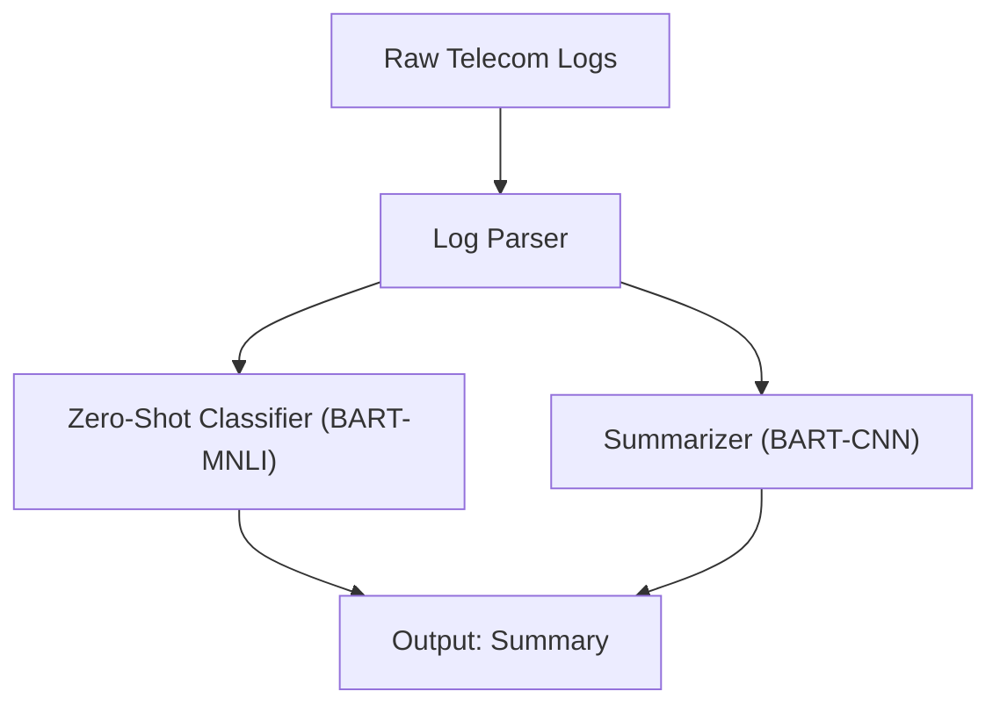

#  AI/GenAI Telecom Log Analysis

A baseline project to analyze telecom (5G) logs using AI and Generative AI.

- **Zero-Shot Classification** → Categorizes raw log messages.  
- **Summarization (GenAI)** → Generates concise summaries of multiple logs.  
- Built with Hugging Face Transformers + PyTorch.

---

##  Usage
```bash
# Activate virtual environment
.venv\Scripts\activate    # Windows

# Run main script
python main_genAI_telco_log.py
```
Architecture (Mermaid Diagram)




Requirements

Python 3.11 (baseline tested)

Hugging Face Transformers

PyTorch

Install all dependencies:
pip install -r requirements.txt

Next Steps

Add plain-English explanations of logs.

Extend for multi-vendor 5G logs.

Build FastAPI/Streamlit front-end.